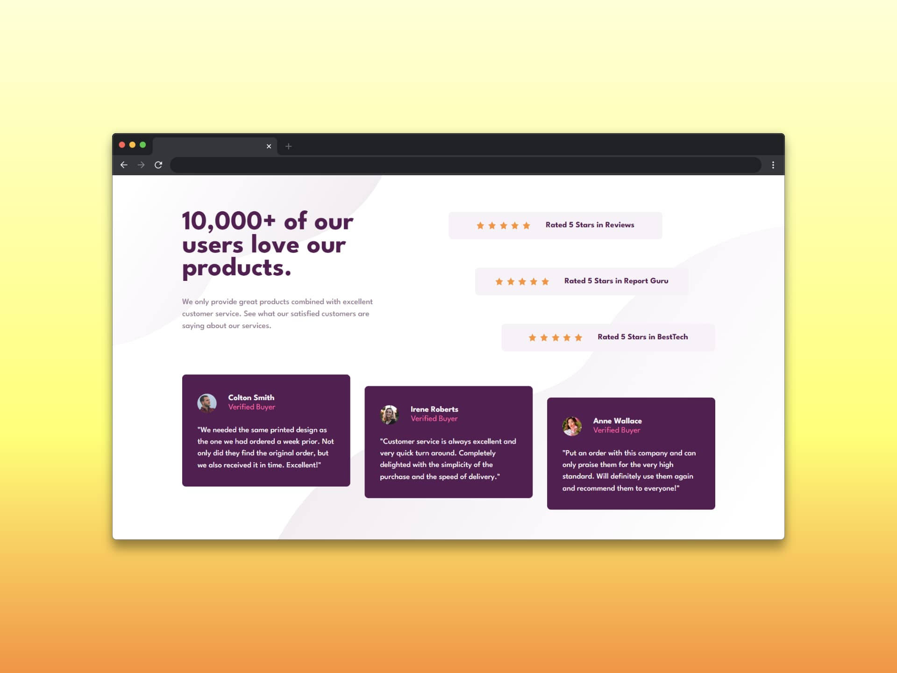

# Sección de prueba social (Social proof section)

Una sección de prueba social o también conocida como social proof es una parte o sección de una página web que utiliza la **psicología social** para influir en las decisiones de los visitantes, para ello, esta sección del sitio muestra las experiencias positivas que otras personas han tenido con el producto o servicio que se está ofreciendo. A grandes rasgos, la base de esta idea, parte del hecho de que la gente tiende a confiar más en un producto o servicio si ve que otras personas lo están usando y sobre todo si ven que lo están recomendando.

## ¿Cómo funciona la prueba social?

La prueba social se puede manifestar de diversas maneras en una web, algunas de las más comunes son:

- **Reseñas y testimonios:** mostrar opiniones positivas de clientes anteriores. 

- **Estudios de caso:** presentar ejemplos concretos de cómo el producto o servicio ha ayudado a otros. 

- **Contenido generado por usuarios:** mostrar contenido creado por clientes, como fotos o videos, que demuestran el uso del producto. 

- **Recomendaciones de influencers:** si un influencer reconocido recomienda el producto o servicio. 

- **Logotipos de clientes:** mostrar los logotipos de empresas conocidas que utilizan el producto o servicio, especialmente si son marcas prestigiosas. 

- **Contadores de ventas o inscripciones:** mostrar el número de personas que han comprado el producto o se han inscrito en el servicio, creando una sensación de popularidad. 

- **Sellos de aprobación:** mostrar sellos de organizaciones reconocidas que avalan el producto. 

## ¿Por qué es importante la prueba social?

La prueba social es importante porque ayuda a:

- Construir confianza
- Generar credibilidad
- Aumentar las conversiones
- Mejorar la experiencia de usuario

En resumen, una sección de prueba social bien implementada puede ser una herramienta poderosa para influir en las decisiones de los visitantes y mejorar el rendimiento de un sitio web.

## Tecnologías usadas

- HTML
- Tailwind CSS
- JavaScript
- React

[Ver app🔗](https://seandsun.github.io/monorepo-zero-react/apps/01-social-proof-section/)

  Challenge by <a href="https://www.frontendmentor.io?ref=challenge" target="_blank">Frontend Mentor</a>. 
  Coded by <a href="https://github.com/seandsun">Seandsun</a>.

 <h3 align="center">< seandsun /></h3>