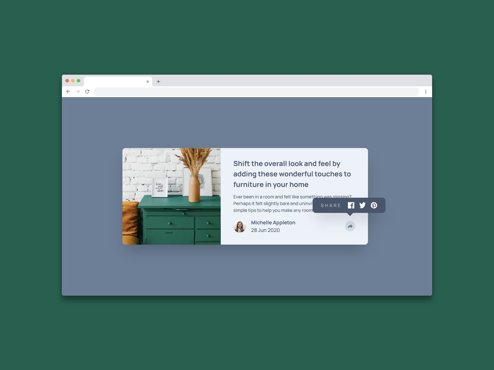

# Componente de vista previa del artículo (Article preview component)

Un componente de vista previa del artículo o Article preview component, sirve para mostrar de forma atractiva y concisa la información de un artículo antes de acceder o visualizarlo completamente, permitiendo a los usuarios interactuar con él de manera visual y rápido. Es importante porque mejora la experiencia del usuario al presentar una breve introducción al artículo de forma atractiva y fácil de entender, lo que puede aumentar el interés y la probabilidad de acceso a este.

Un componente de vista previa de artículo es útil por que:

- Facilita la creación de componentes tipo tarjetas que son visualmente atractivas ya que pueden tener imágenes, títulos, descripciones y posibles botones de llamada a la acción o call to action.
- Estimula la interacción del usuario ya que permiten explorar rápidamente una breve introducción del artículo sin tener que abandonar la página principal.
- Mejora la experiencia del usuario (UX) ya que puede hacer que la navegación por el sitio web sea más intuitiva y agradable.
- Aumenta el engagement ya que un diseño visualmente atractivo puede captar la atención del usuario y animarlo a hacer clic y leer más.
- Flexibiliza la personalización debiado a que muchos componentes de tipo tarjetas de vista previa son personalizables, lo que permite a los desarrolladores adaptarlos a las necesidades específicas de su marca y producto, lo cual ahorra tiempo y esfuerzo en desarrollo y permite su reutilización en diferentes partes del sitio web o app.

## Tecnologías usadas

- HTML
- Tailwind CSS
- JavaScript
- React

[Ver app🔗](https://)

  Challenge by <a href="https://www.frontendmentor.io?ref=challenge" target="_blank">Frontend Mentor</a>. 
  Coded by <a href="https://github.com/seandsun">Seandsun</a>.

 <h3 align="center">< seandsun /></h3>