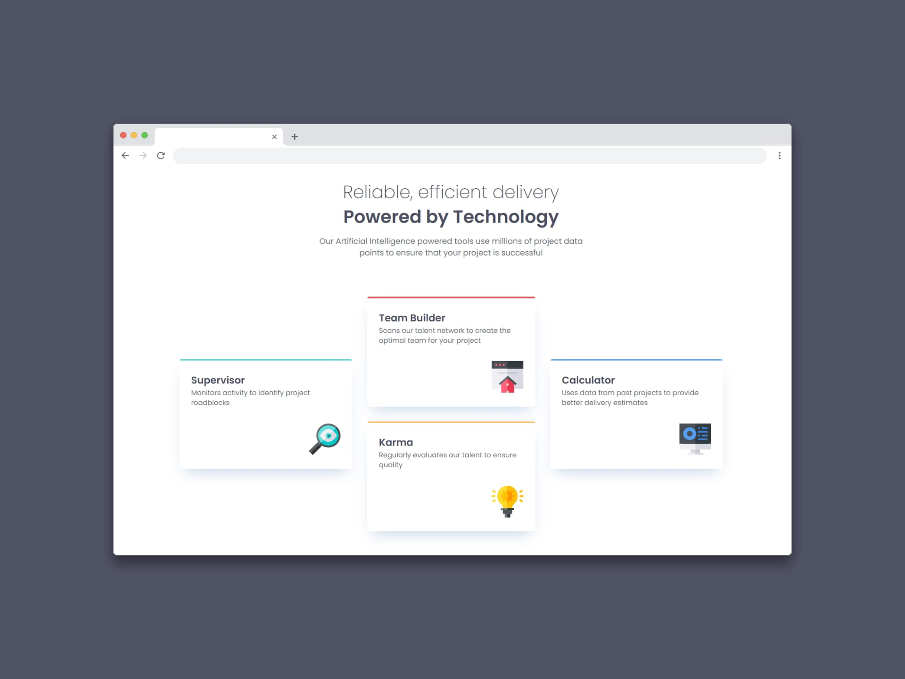

# Sección de funciones de cuatro tarjetas (Four card feature section)

Una sección de tarjetas es un diseño de interfaz de usuario que **organiza la información en unidades visualmente similares a tarjetas, cada una con contenido específico y, a menudo, interactivo**. Estas tarjetas facilitan la presentación de información de forma clara y concisa, permitiendo a los usuarios navegar y acceder a diferentes secciones de contenido de manera más intuitiva.

Algunos beneficios de usar tarjetas son:

- Mejor experiencia de usuario ya que la organización en tarjetas facilita la navegación y la comprensión del contenido. 
- Optimización del espacio ya que las tarjetas permiten mostrar mucha información en un espacio limitado, sin abrumar al usuario. 
- Diseño atractivo y moderno ya que las tarjetas son visualmente atractivas y pueden adaptarse a diferentes estilos de diseño. 
- Facilitan la gestión de contenido ya que el diseño modular permite a los desarrolladores y diseñadores actualizar y gestionar el contenido de forma más eficiente.

## Tecnologías usadas

- HTML
- Tailwind CSS
- JavaScript
- React

[Ver app🔗](https://)

  Challenge by <a href="https://www.frontendmentor.io?ref=challenge" target="_blank">Frontend Mentor</a>. 
  Coded by <a href="https://github.com/seandsun">Seandsun</a>.

 <h3 align="center">< seandsun /></h3>