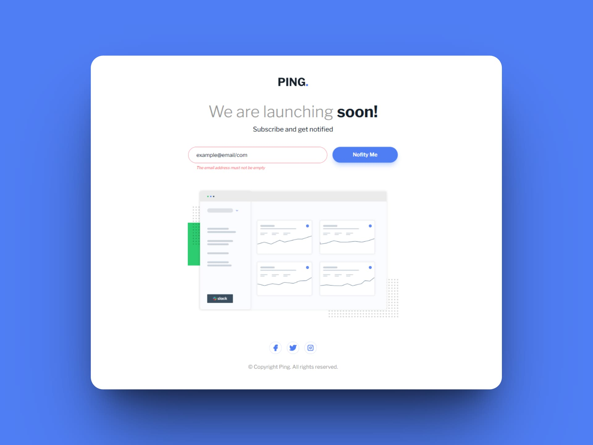

# Página de próximamente de Ping (Ping coming soon page)

Una landing page con el mensaje "¡Pronto lanzaremos!" o "We are launching soon!" es una página de aterrizaje de tipo "próximamente" o "coming soon". Este tipo de landing page se utiliza para generar expectativa e interés antes del lanzamiento oficial de un sitio web, producto o servicio. Su objetivo principal es captar la atención de los visitantes y recopilar información de contacto, como direcciones de correo electrónico, para notificarles sobre el lanzamiento.

En detalle, una landing page "próximamente" o "coming soon" suele tener las siguientes características:

- Mensaje de anticipación el cual indica que algo está por llegar, en este caso, la página web de Ping.
- Formulario de suscripción para permitir a los visitantes registrarse y que luego puedan recibir notificaciones sobre el lanzamiento.
- Diseño minimalista y atractivo para que los visitantes se enfoquen en la información principal, evitando distracciones y guiándolos hacia la acción deseada.
- Posible cuenta regresiva, se podría incluir un contador que indica el tiempo restante para el lanzamiento, generando aún más expectación.
- Elementos visuales, se suele incluir imágenes o videos relacionados con el producto o servicio que se lanzará.

En resumen, la landing page "We are launching soon!" de Ping es una estrategia para crear una base de contactos antes de su lanzamiento oficial, generando expectativa y facilitando la comunicación con los potenciales clientes.

## Tecnologías usadas

- HTML
- Tailwind CSS
- JavaScript
- React

### Librerías

- [React Hook Form🔗](https://react-hook-form.com/) 
- [React Hot Toast🔗](https://react-hot-toast.com/)

[Ver app🔗](https://seandsun.github.io/monorepo-zero-react/apps/04-ping-coming-soon-page/)

  Challenge by <a href="https://www.frontendmentor.io?ref=challenge" target="_blank">Frontend Mentor</a>. 
  Coded by <a href="https://github.com/seandsun">Seandsun</a>.

 <h3 align="center">< seandsun /></h3>