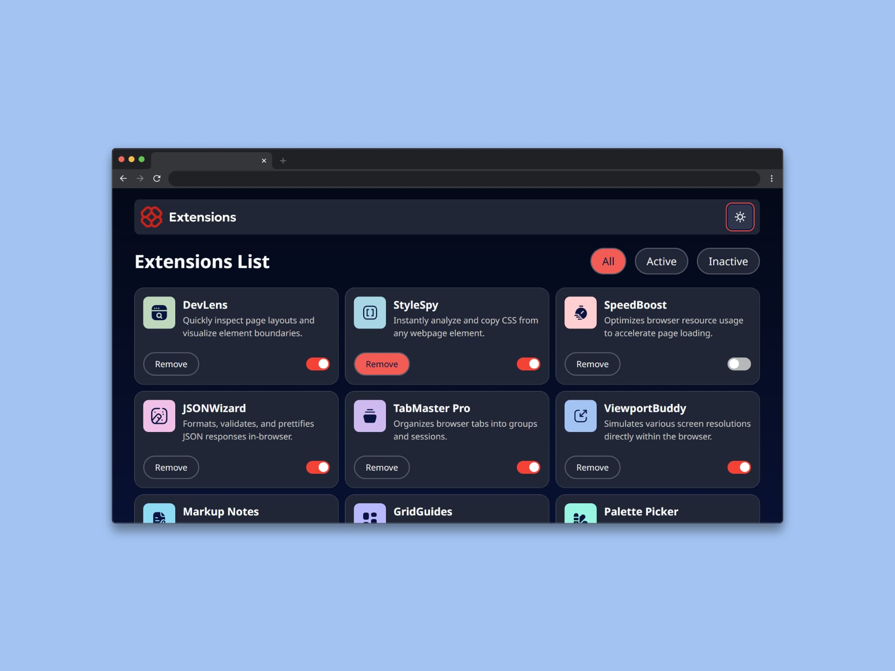

# Interfaz de usuario de administrador de extensiones del navegador (Browser extensions manager UI)

Una interfaz de usuario de administrador de extensiones del navegador **sirve para que los usuarios puedan ver, gestionar y configurar las extensiones** instaladas en su navegador web. Esta interfaz actúa como un **panel de control** para controlar el comportamiento de las extensiones y garantizar que el navegador funcione de manera segura y personalizada.

Las principales funciones de esta interfaz es:

- **Ver extensiones instaladas:** muestra una lista de todas las extensiones que están actualmente instaladas en el navegador.
- **Activar o desactivar extensiones:** permite encender o apagar extensiones sin desinstalarlas.
- **Desinstalar extensiones:** facilita la eliminación permanente de extensiones no deseadas.
- **Actualizar extensiones:** algunas interfaces permiten actualizar manualmente las extensiones instaladas.
- **Ver permisos de las extensiones:** informa sobre los accesos que tiene cada extensión (por ejemplo, acceso al historial de navegación, pestañas, sitios específicos, etc.).
- **Configurar opciones específicas:** algunas extensiones permiten ajustes personalizados desde esta interfaz (como cambiar temas, cuentas, etc.).
- **Modo desarrollador (en algunos navegadores):** permite a desarrolladores cargar extensiones desde archivos locales, ver errores y acceder a herramientas de depuración.

## Tecnologías usadas

- HTML
- Tailwind CSS
- JavaScript
- React

### Librerías

- [React Suite🔗](https://rsuitejs.com/) 

[Ver app🔗](https://seandsun.github.io/monorepo-zero-react/apps/05-browser-extensions-manager-ui/)

  Challenge by <a href="https://www.frontendmentor.io?ref=challenge" target="_blank">Frontend Mentor</a>. 
  Coded by <a href="https://github.com/seandsun">Seandsun</a>.

 <h3 align="center">< seandsun /></h3>